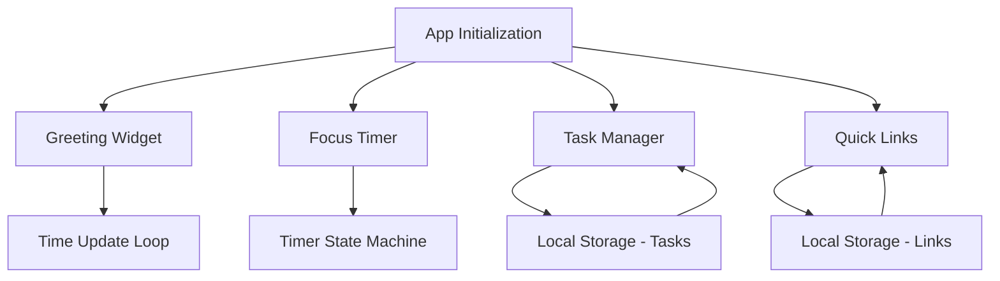
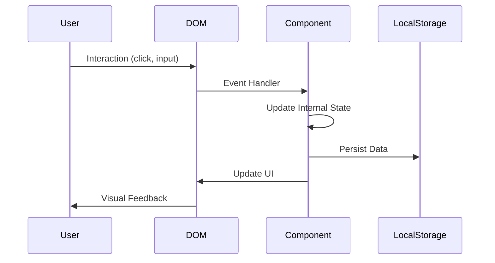

# Design Document: Productivity Dashboard

## Overview

The Productivity Dashboard is a client-side web application built with vanilla JavaScript, HTML, and CSS. It provides a unified interface for personal productivity tools including a time-based greeting, a 25-minute focus timer, task management, and quick links to favorite websites. All data is persisted using the browser's Local Storage API, ensuring the application works entirely offline without requiring a backend server.

### Key Design Principles

1. **Simplicity**: Single-page application with minimal dependencies (vanilla JavaScript only)
2. **Persistence**: All user data stored in Local Storage for seamless experience across sessions
3. **Modularity**: Component-based architecture despite vanilla JavaScript constraints
4. **Performance**: Efficient DOM updates and minimal reflows for smooth user experience
5. **Maintainability**: Clear separation of concerns between structure, styling, and behavior

### Technology Stack

- **HTML5**: Semantic markup for document structure
- **CSS3**: Modern styling with flexbox/grid for layout
- **Vanilla JavaScript (ES6+)**: No frameworks or libraries
- **Local Storage API**: Client-side data persistence
- **Target Browsers**: Chrome, Firefox, Edge, Safari (latest versions)

## Architecture

### Application Structure

```
productivity-dashboard/
├── index.html          # Main entry point
├── css/
│   └── styles.css      # All application styles
└── js/
    └── app.js          # All application logic
```

### Component Architecture

The application follows a component-based mental model implemented in vanilla JavaScript. Each major feature is encapsulated as a logical component with its own initialization, state management, and DOM manipulation logic.



### State Management

Since we're using vanilla JavaScript without a state management library, each component manages its own state:

1. **Greeting Widget**: Stateless, derives display from current time
2. **Focus Timer**: Maintains timer state (running/paused/stopped, remaining time)
3. **Task Manager**: Maintains task array synchronized with Local Storage
4. **Quick Links**: Maintains links array synchronized with Local Storage

### Data Flow



## Components and Interfaces

### 1. Greeting Widget Component

**Purpose**: Display current time, date, and time-appropriate greeting

**DOM Structure**:
```html
<div class="greeting-widget">
  <div class="time-display">HH:MM:SS AM/PM</div>
  <div class="date-display">Day, Month Date, Year</div>
  <div class="greeting-message">Good Morning/Afternoon/Evening/Night</div>
</div>
```

**JavaScript Interface**:
```javascript
const GreetingWidget = {
  init() { /* Initialize and start update loop */ },
  update() { /* Update time, date, and greeting */ },
  getGreeting(hour) { /* Return appropriate greeting based on hour */ },
  formatTime(date) { /* Format time as 12-hour with AM/PM */ },
  formatDate(date) { /* Format date as readable string */ }
}
```

**Update Mechanism**: Uses `setInterval` with 1000ms interval to update display every second

**Greeting Logic**:
- 5:00 AM - 11:59 AM: "Good Morning"
- 12:00 PM - 4:59 PM: "Good Afternoon"
- 5:00 PM - 8:59 PM: "Good Evening"
- 9:00 PM - 4:59 AM: "Good Night"

### 2. Focus Timer Component

**Purpose**: 25-minute countdown timer for focused work sessions

**DOM Structure**:
```html
<div class="focus-timer">
  <div class="timer-display">25:00</div>
  <div class="timer-controls">
    <button class="btn-start">Start</button>
    <button class="btn-stop">Stop</button>
    <button class="btn-reset">Reset</button>
  </div>
  <div class="timer-status"></div>
</div>
```

**JavaScript Interface**:
```javascript
const FocusTimer = {
  state: {
    duration: 25 * 60, // 25 minutes in seconds
    remaining: 25 * 60,
    isRunning: false,
    intervalId: null
  },
  init() { /* Initialize timer and attach event listeners */ },
  start() { /* Begin countdown */ },
  stop() { /* Pause countdown */ },
  reset() { /* Reset to 25 minutes */ },
  tick() { /* Decrement remaining time */ },
  updateDisplay() { /* Update MM:SS display */ },
  formatTime(seconds) { /* Convert seconds to MM:SS */ },
  handleComplete() { /* Handle timer reaching 00:00 */ }
}
```

**State Machine**:
- **Stopped**: Initial state, remaining = 25:00
- **Running**: Counting down, interval active
- **Paused**: Countdown paused, remaining time preserved
- **Complete**: Reached 00:00, visual indication shown

**Timer Mechanism**: Uses `setInterval` with 1000ms interval when running

### 3. Task Manager Component

**Purpose**: CRUD operations for to-do list items

**DOM Structure**:
```html
<div class="task-manager">
  <form class="task-form">
    <input type="text" class="task-input" placeholder="Add a new task...">
    <button type="submit" class="btn-add-task">Add</button>
  </form>
  <ul class="task-list">
    <!-- Task items dynamically inserted -->
  </ul>
</div>

<!-- Task item template -->
<li class="task-item" data-task-id="uuid">
  <input type="checkbox" class="task-checkbox">
  <span class="task-description">Task text</span>
  <button class="btn-edit-task">Edit</button>
  <button class="btn-delete-task">Delete</button>
</li>
```

**JavaScript Interface**:
```javascript
const TaskManager = {
  tasks: [],
  init() { /* Load from storage and attach listeners */ },
  loadTasks() { /* Retrieve tasks from Local Storage */ },
  saveTasks() { /* Persist tasks to Local Storage */ },
  addTask(description) { /* Create new task */ },
  deleteTask(id) { /* Remove task */ },
  updateTask(id, updates) { /* Modify task properties */ },
  toggleComplete(id) { /* Toggle completion status */ },
  renderTasks() { /* Update DOM with current tasks */ },
  renderTask(task) { /* Create DOM element for single task */ },
  generateId() { /* Generate unique task ID */ }
}
```

**Task Data Model**:
```javascript
{
  id: "unique-string",
  description: "Task description text",
  completed: false,
  createdAt: timestamp
}
```

**Local Storage Key**: `productivity-dashboard-tasks`

### 4. Quick Links Component

**Purpose**: Manage and display favorite website shortcuts

**DOM Structure**:
```html
<div class="quick-links">
  <form class="link-form">
    <input type="text" class="link-name-input" placeholder="Link name">
    <input type="url" class="link-url-input" placeholder="https://example.com">
    <button type="submit" class="btn-add-link">Add Link</button>
  </form>
  <div class="links-container">
    <!-- Link buttons dynamically inserted -->
  </div>
</div>

<!-- Link button template -->
<div class="link-item" data-link-id="uuid">
  <a href="url" target="_blank" class="link-button">Link Name</a>
  <button class="btn-delete-link">×</button>
</div>
```

**JavaScript Interface**:
```javascript
const QuickLinks = {
  links: [],
  init() { /* Load from storage and attach listeners */ },
  loadLinks() { /* Retrieve links from Local Storage */ },
  saveLinks() { /* Persist links to Local Storage */ },
  addLink(name, url) { /* Create new link */ },
  deleteLink(id) { /* Remove link */ },
  validateUrl(url) { /* Ensure URL starts with http:// or https:// */ },
  renderLinks() { /* Update DOM with current links */ },
  renderLink(link) { /* Create DOM element for single link */ },
  generateId() { /* Generate unique link ID */ }
}
```

**Link Data Model**:
```javascript
{
  id: "unique-string",
  name: "Display Name",
  url: "https://example.com",
  createdAt: timestamp
}
```

**Local Storage Key**: `productivity-dashboard-links`

**URL Validation**: Must start with `http://` or `https://`, reject empty strings

### 5. Application Controller

**Purpose**: Initialize all components and coordinate application lifecycle

**JavaScript Interface**:
```javascript
const App = {
  init() {
    // Initialize all components in order
    GreetingWidget.init();
    FocusTimer.init();
    TaskManager.init();
    QuickLinks.init();
    
    // Set up any global event listeners
    this.setupGlobalListeners();
  },
  setupGlobalListeners() {
    // Handle page visibility changes, etc.
  }
}

// Start application when DOM is ready
document.addEventListener('DOMContentLoaded', () => App.init());
```

## Data Models

### Task Model

```javascript
interface Task {
  id: string;           // Unique identifier (UUID or timestamp-based)
  description: string;  // Task description text (non-empty)
  completed: boolean;   // Completion status
  createdAt: number;    // Unix timestamp of creation
}
```

**Validation Rules**:
- `description`: Must be non-empty string after trimming whitespace
- `completed`: Boolean value, defaults to `false`
- `id`: Must be unique within the tasks array

**Storage Format**: JSON array serialized to Local Storage

### Link Model

```javascript
interface Link {
  id: string;        // Unique identifier (UUID or timestamp-based)
  name: string;      // Display name for the link (non-empty)
  url: string;       // Full URL including protocol (http:// or https://)
  createdAt: number; // Unix timestamp of creation
}
```

**Validation Rules**:
- `name`: Must be non-empty string after trimming whitespace
- `url`: Must be non-empty and start with `http://` or `https://`
- `id`: Must be unique within the links array

**Storage Format**: JSON array serialized to Local Storage

### Local Storage Schema

**Keys**:
- `productivity-dashboard-tasks`: Serialized array of Task objects
- `productivity-dashboard-links`: Serialized array of Link objects

**Storage Operations**:
```javascript
// Save
localStorage.setItem(key, JSON.stringify(data));

// Load
const data = JSON.parse(localStorage.getItem(key) || '[]');

// Clear (for testing/reset)
localStorage.removeItem(key);
```

**Error Handling**: Wrap all Local Storage operations in try-catch blocks to handle:
- Storage quota exceeded
- JSON parse errors (corrupted data)
- Browser privacy modes that disable storage


## Correctness Properties

*A property is a characteristic or behavior that should hold true across all valid executions of a system—essentially, a formal statement about what the system should do. Properties serve as the bridge between human-readable specifications and machine-verifiable correctness guarantees.*

### Property Reflection

After analyzing all acceptance criteria, I identified several areas where properties can be consolidated:

**Greeting Time Ranges (1.3-1.6)**: These four separate time range checks can be combined into a single comprehensive property that validates the greeting function maps all 24 hours correctly.

**Task Persistence (4.1-4.4)**: These four separate persistence operations can be consolidated into a single round-trip property that validates serialization/deserialization works correctly for all task operations.

**Link Persistence (6.1-6.2)**: Similar to tasks, link persistence can be validated with a round-trip property.

**Storage Loading (4.5, 6.3)**: These are covered by the round-trip properties above.

**Visual Feedback (7.5-7.6)**: These are specific examples rather than properties and will be tested as unit tests.

**File Structure (10.1-10.3)**: These are specific examples verifying project structure.

### Property 1: Time Format Validation

*For any* valid Date object, the time formatting function should produce a string in 12-hour format with AM/PM indicator (HH:MM:SS AM/PM pattern).

**Validates: Requirements 1.1**

### Property 2: Date Format Consistency

*For any* valid Date object, the date formatting function should produce a consistent, readable format containing day of week, month, date, and year.

**Validates: Requirements 1.2**

### Property 3: Greeting Time Range Coverage

*For any* hour value (0-23), the greeting function should return exactly one of the four valid greetings: "Good Morning" (5-11), "Good Afternoon" (12-16), "Good Evening" (17-20), or "Good Night" (21-4).

**Validates: Requirements 1.3, 1.4, 1.5, 1.6**

### Property 4: Timer Stop Preserves State

*For any* timer state with remaining time, stopping the timer should preserve the exact remaining time value without modification.

**Validates: Requirements 2.3**

### Property 5: Timer Reset Idempotence

*For any* timer state, resetting should always return to 25 minutes (1500 seconds), and resetting multiple times should produce the same result.

**Validates: Requirements 2.4**

### Property 6: Timer Display Format

*For any* non-negative integer representing seconds, the timer format function should produce MM:SS format where MM is zero-padded minutes and SS is zero-padded seconds.

**Validates: Requirements 2.5**

### Property 7: Task Creation Increases List Size

*For any* valid (non-empty) task description, adding it to the task list should increase the list length by exactly one.

**Validates: Requirements 3.1**

### Property 8: Task Creation Order Preservation

*For any* sequence of task additions, the order in which tasks appear in the list should match the order in which they were created.

**Validates: Requirements 3.2**

### Property 9: Task Toggle Idempotence

*For any* task, toggling completion status twice should return the task to its original completion state.

**Validates: Requirements 3.3**

### Property 10: Completed Task Visual Indicator

*For any* task marked as completed, the rendered DOM element should contain a visual indicator (checked checkbox or completion class).

**Validates: Requirements 3.4**

### Property 11: Task Deletion Removes Item

*For any* task in the list, deleting it should result in the task no longer appearing in the task list.

**Validates: Requirements 3.5**

### Property 12: Task Description Update

*For any* task and any valid new description, updating the task description should result in the task having the new description.

**Validates: Requirements 3.7**

### Property 13: Empty Task Rejection

*For any* string composed entirely of whitespace (including empty string), attempting to create a task should be rejected and the task list should remain unchanged.

**Validates: Requirements 3.8**

### Property 14: Task Storage Round-Trip

*For any* array of valid tasks, saving to Local Storage and then loading should produce an equivalent array of tasks with all properties preserved.

**Validates: Requirements 4.1, 4.2, 4.3, 4.4, 4.5**

### Property 15: Link Creation Increases List Size

*For any* valid name and URL, adding a link should increase the links list length by exactly one.

**Validates: Requirements 5.1**

### Property 16: All Links Rendered as Clickable

*For any* array of links, all links should be rendered in the DOM with clickable anchor elements containing correct href attributes.

**Validates: Requirements 5.2**

### Property 17: Link Target Attribute

*For any* rendered link, the anchor element should have target="_blank" to open in a new tab.

**Validates: Requirements 5.3**

### Property 18: Link Deletion Removes Item

*For any* link in the list, deleting it should result in the link no longer appearing in the links list.

**Validates: Requirements 5.4**

### Property 19: Empty Link Rejection

*For any* link where name or URL is empty or whitespace-only, attempting to create the link should be rejected and the links list should remain unchanged.

**Validates: Requirements 5.5**

### Property 20: URL Protocol Validation

*For any* URL that does not start with "http://" or "https://", attempting to create a link should be rejected and the links list should remain unchanged.

**Validates: Requirements 5.6**

### Property 21: Link Storage Round-Trip

*For any* array of valid links, saving to Local Storage and then loading should produce an equivalent array of links with all properties preserved.

**Validates: Requirements 6.1, 6.2, 6.3**

### Property 22: Text Contrast Ratio

*For any* text element and its background, the contrast ratio should meet WCAG AA standards (minimum 4.5:1 for normal text, 3:1 for large text).

**Validates: Requirements 7.7**

## Error Handling

### Local Storage Errors

**Quota Exceeded**:
- Wrap all `localStorage.setItem()` calls in try-catch blocks
- Display user-friendly error message when storage quota is exceeded
- Suggest clearing old data or using fewer items
- Gracefully degrade: allow app to function without persistence

**Parse Errors**:
- Wrap all `JSON.parse()` calls in try-catch blocks
- If corrupted data is detected, clear the corrupted key and start fresh
- Log error to console for debugging
- Display notification to user that data was reset

**Storage Disabled**:
- Detect if Local Storage is available on app initialization
- If unavailable (private browsing mode), display warning to user
- Allow app to function in memory-only mode
- Warn user that data will not persist across sessions

```javascript
function isLocalStorageAvailable() {
  try {
    const test = '__storage_test__';
    localStorage.setItem(test, test);
    localStorage.removeItem(test);
    return true;
  } catch (e) {
    return false;
  }
}
```

### Input Validation Errors

**Empty Input**:
- Prevent form submission when required fields are empty
- Display inline validation message
- Focus remains on input field
- No error thrown, graceful UI feedback

**Invalid URL Format**:
- Validate URL format before creating link
- Display inline validation message explaining required format
- Provide example: "URL must start with http:// or https://"
- Allow user to correct input

**Malformed Data**:
- If task or link object is missing required properties, skip it during rendering
- Log warning to console
- Continue rendering other valid items
- Prevent app crash from single bad data item

### Timer Edge Cases

**Timer at Zero**:
- Prevent timer from going negative
- Stop interval when reaching 0
- Display completion state
- Disable start button until reset

**Multiple Start Clicks**:
- Check if timer is already running before starting
- Prevent multiple intervals from being created
- Ignore subsequent start clicks while running

**Page Visibility**:
- Timer continues running when page is not visible
- Time remains accurate when user returns to tab
- Consider using `document.visibilityState` for pause/resume if desired

### DOM Manipulation Errors

**Missing Elements**:
- Check for element existence before attaching event listeners
- Use optional chaining or null checks
- Log warning if expected element is missing
- Prevent null reference errors

**Event Listener Cleanup**:
- Remove event listeners when elements are removed from DOM
- Use event delegation where appropriate to minimize listeners
- Prevent memory leaks from orphaned listeners

## Testing Strategy

### Overview

The testing strategy employs a dual approach combining unit tests for specific examples and edge cases with property-based tests for universal correctness guarantees. This ensures both concrete behavior validation and comprehensive input coverage.

### Property-Based Testing

**Library**: [fast-check](https://github.com/dubzzz/fast-check) for JavaScript

**Configuration**:
- Minimum 100 iterations per property test
- Each test tagged with reference to design document property
- Tag format: `Feature: productivity-dashboard, Property {number}: {property_text}`

**Property Test Examples**:

```javascript
// Property 1: Time Format Validation
fc.assert(
  fc.property(fc.date(), (date) => {
    const formatted = formatTime(date);
    const pattern = /^\d{1,2}:\d{2}:\d{2} (AM|PM)$/;
    return pattern.test(formatted);
  }),
  { numRuns: 100 }
);
// Feature: productivity-dashboard, Property 1: Time Format Validation

// Property 3: Greeting Time Range Coverage
fc.assert(
  fc.property(fc.integer({ min: 0, max: 23 }), (hour) => {
    const greeting = getGreeting(hour);
    const validGreetings = ['Good Morning', 'Good Afternoon', 'Good Evening', 'Good Night'];
    return validGreetings.includes(greeting);
  }),
  { numRuns: 100 }
);
// Feature: productivity-dashboard, Property 3: Greeting Time Range Coverage

// Property 9: Task Toggle Idempotence
fc.assert(
  fc.property(fc.record({ id: fc.string(), description: fc.string(), completed: fc.boolean() }), (task) => {
    const original = task.completed;
    toggleComplete(task.id);
    toggleComplete(task.id);
    const final = tasks.find(t => t.id === task.id).completed;
    return original === final;
  }),
  { numRuns: 100 }
);
// Feature: productivity-dashboard, Property 9: Task Toggle Idempotence

// Property 14: Task Storage Round-Trip
fc.assert(
  fc.property(fc.array(fc.record({
    id: fc.string(),
    description: fc.string({ minLength: 1 }),
    completed: fc.boolean(),
    createdAt: fc.integer()
  })), (tasks) => {
    saveTasks(tasks);
    const loaded = loadTasks();
    return JSON.stringify(tasks) === JSON.stringify(loaded);
  }),
  { numRuns: 100 }
);
// Feature: productivity-dashboard, Property 14: Task Storage Round-Trip
```

### Unit Testing

**Library**: [Vitest](https://vitest.dev/) or [Jest](https://jestjs.io/)

**Focus Areas**:
- Specific examples demonstrating correct behavior
- Edge cases (empty states, boundary conditions)
- Error conditions and validation
- Integration between components

**Unit Test Examples**:

```javascript
// Example: Timer initializes to 25 minutes
test('Focus timer initializes to 25 minutes', () => {
  const timer = FocusTimer.init();
  expect(timer.state.remaining).toBe(1500); // 25 * 60 seconds
});

// Edge case: Timer at zero stops automatically
test('Timer stops automatically at zero', () => {
  FocusTimer.state.remaining = 1;
  FocusTimer.tick();
  expect(FocusTimer.state.remaining).toBe(0);
  expect(FocusTimer.state.isRunning).toBe(false);
});

// Edge case: Empty task list displays correctly
test('Empty task list displays empty state', () => {
  TaskManager.tasks = [];
  TaskManager.renderTasks();
  const taskList = document.querySelector('.task-list');
  expect(taskList.children.length).toBe(0);
});

// Error condition: Invalid URL rejected
test('Link creation rejects invalid URL', () => {
  const initialLength = QuickLinks.links.length;
  QuickLinks.addLink('Test', 'not-a-url');
  expect(QuickLinks.links.length).toBe(initialLength);
});

// Integration: Task creation updates DOM and storage
test('Creating task updates both DOM and Local Storage', () => {
  TaskManager.addTask('Test task');
  
  // Check DOM
  const taskElements = document.querySelectorAll('.task-item');
  expect(taskElements.length).toBeGreaterThan(0);
  
  // Check storage
  const stored = JSON.parse(localStorage.getItem('productivity-dashboard-tasks'));
  expect(stored.some(t => t.description === 'Test task')).toBe(true);
});
```

### Test Organization

```
tests/
├── unit/
│   ├── greeting-widget.test.js
│   ├── focus-timer.test.js
│   ├── task-manager.test.js
│   └── quick-links.test.js
├── properties/
│   ├── greeting-properties.test.js
│   ├── timer-properties.test.js
│   ├── task-properties.test.js
│   └── link-properties.test.js
└── integration/
    └── app-integration.test.js
```

### Testing Best Practices

1. **Isolation**: Each test should be independent and not rely on other tests
2. **Setup/Teardown**: Clear Local Storage before each test to ensure clean state
3. **DOM Mocking**: Use JSDOM or similar for DOM manipulation tests
4. **Async Handling**: Properly handle timer-based async operations in tests
5. **Coverage Goals**: Aim for 80%+ code coverage, 100% of correctness properties tested
6. **Continuous Integration**: Run tests on every commit

### Manual Testing Checklist

While automated tests cover functional correctness, manual testing is required for:

- Visual design consistency (Requirement 7.1-7.4)
- Performance and responsiveness feel (Requirement 8)
- Cross-browser compatibility (Requirement 9.1-9.4)
- Accessibility with screen readers
- Mobile/tablet responsive behavior (if applicable)
- User experience flow and intuitiveness

